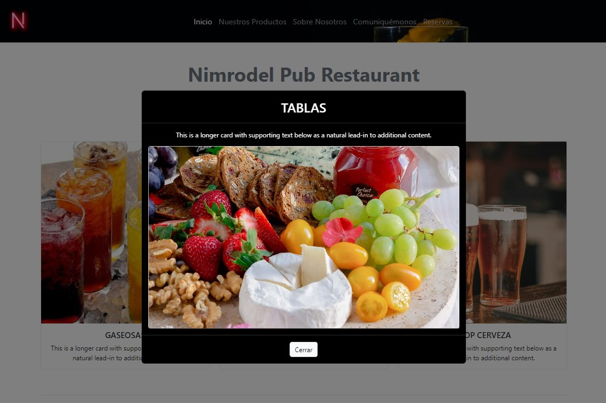

<h3 align = "center"> N I M R O D E L - P U B - R E S T A U R A N T</h3>

  

## DESCRIPCIÓN: 
La página se creo para aprender y practicar el desarrollo front-end, simulando la creación de un sitio web de un Restaurant.
 

## DESARROLLO: 
- El codígo se desarrolló con el lenguaje javaScript usando el editor VS-Code. 
- Para el estilo se utilizó Bootstrap y CSS. Además contiene iconos Awesome.
- La página es responsive, utilizando tambíen mediaqueries.
- El código incluye el apoyo de la librería JQuery.
 

## IMÁGENES DEMO
### Sección principal

#### Menu
La página principal contiene un menu de navegación responsive con menu hamburguesa para dispositos más pequeños.
 
 

 
 
El menu es de tipo hamburguesa para dispositos más pequeños.
 
 

#### Portada principal
La sección de servicios cuenta con una descripción y puede ampliarse al hacer click sobre cada cuadro, a fin de visualizarse en un tamaño mayor para más comodidad.
 
 

 
 

#### Pie de página

La parte inferior de la página lleva un carrousel de fotos de los servicios del restaurant, el cual está habilitado para transiciones automáticas.
 
 

 
 

#### Sección "Sobre Nosotros"

La descricipción del restaurante se encuentra en el menu y al presionar el link se despliega un modal con carrousel que contiene la información acerca del restaurant.
 
 

 
 

### Formularios de contacto y para reservas
Los formularios se encuentran validados para controlar su llenado con información correcta y generan un mensaje de alerta en caso de no cumplir con los requisitos de registro.
 
 

 
 
Los formularios generan un mensaje de confirmación una vez se presiona el botón de envío.
 
 

 
 

### DEPLOYMENT
Se puede visualizar el sitio en el siguiente link:
https://lrldlk.github.io/f-r-o-n-t---e-n-d/
